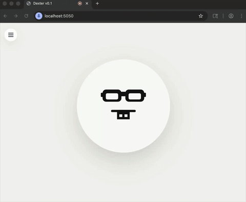

# Dexter

Dexter is an AI voice assistant prototype built to run **100% locally on consumer hardware**. Working right now a single Apple Silicon laptop (2024 M3 Macbook Air, 24Gb RAM), headless edge device support soon.

## 🎥 [Watch the Video Demo (with audio)](https://youtu.be/5lL7rom7XGA)

Wake word detection of `dexter` runs in the browser, audio is streamed to a small Python backend, and the backend owns the speech-to-text, language model, external system tool calls, and text-to-speech pipeline.

One of the main design decisions is to keep the backend wake-engine agnostic. The next steps are to run a simple on-premise inference server, with headless edge devices that do the wake word detection. Eventual goal would be to replace my house's proprietary voice assistant devices with Dexter.

## Local-First Runtime Architecture

Dexter is designed around a simple constraint: the full assistant loop should fit on consumer hardware, with a realistic target of a single 24GB RAM/VRAM machine acting as the home inference server. The current stack keeps speech recognition, language generation, and speech synthesis local, using `mlx-whisper` for STT and `LiquidAI/LFM2-24B-A2B-MLX-4bit` through raw `mlx-lm` primitives for response generation. Models are loaded once and warmed at startup to keep first-turn latency manageable.

The architecture is intentionally modular. Wake word detection, audio streaming, STT, LLM reasoning, tool execution, and TTS are all separated behind clean boundaries so the system can evolve from a browser client today to headless edge microphones later without changing the backend contract. Audio is streamed in small chunks, capture ends on lightweight silence detection, and the server remains agnostic to how wake word detection happens upstream.

Tool use follows the same design philosophy. Rather than binding the project to a model-specific tool API, Dexter is being structured around a small JSON-based tool invocation layer so the local model can call arbitrary backend tools in a controlled way. That makes it possible to add practical capabilities like calculation, read-only calendar access, or explicit external LLM passthrough without coupling the system to one vendor's runtime.

## Interesting Implementation Discoveries

### Failed tool calls were masked, model attempted to respond from weights

One of the more interesting failure modes showed up when the model tried to answer a Fibonacci question using the calculator tool. It generated an expression involving `fibonacci(n)`, but the calculator did not support that function and returned a deterministic tool error. By default, the LLM would ignore the failed tool result and answer anyway from its own weights, **producing a plausible-looking response that was not actually grounded in tool execution**. That is a subtle but important failure mode for local assistants: the system appears to have used a deterministic tool, but in reality it silently fell back to model knowledge. The fix was to treat deterministic tool failures as authoritative and force a grounded failure response instead of allowing an unverified final answer.
